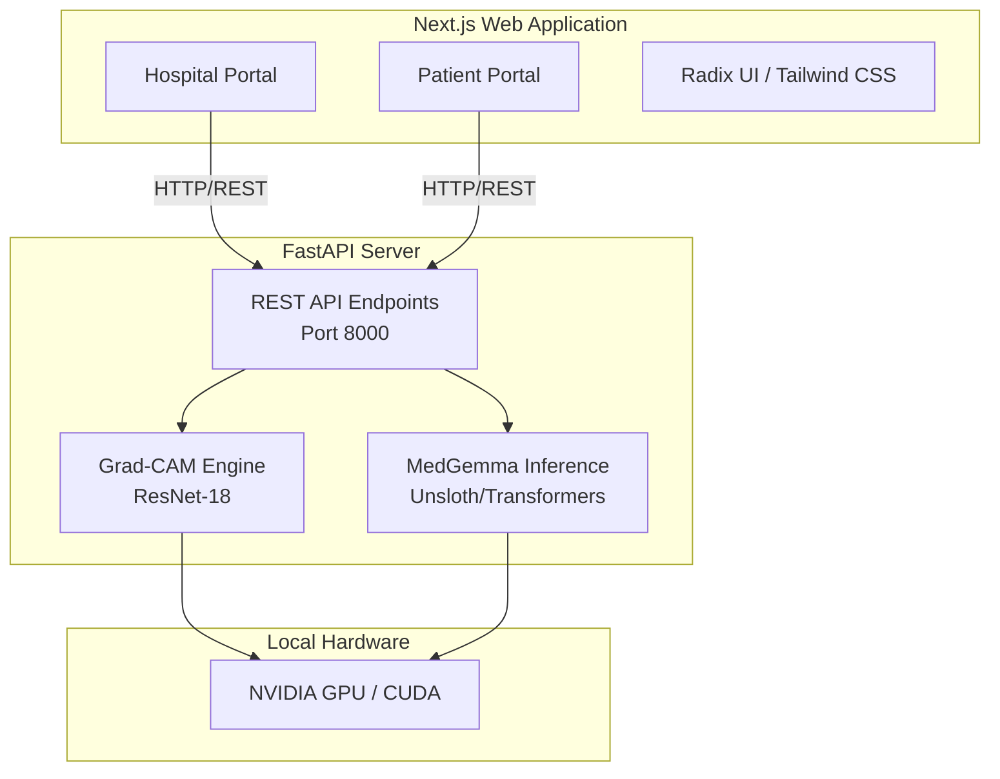

# OmniMed: Local AI-Powered Clinical Decision Support System


## Executive Summary

OmniMed is an advanced, privacy-first clinical decision support platform designed to provide AI-assisted medical imaging analysis entirely on local infrastructure. By leveraging quantized large language models (MedGemma) and convolutional neural networks (ResNet), OmniMed delivers zero-latency, highly secure diagnostic insights without data ever leaving the organization's perimeter.

This repository houses the complete full-stack solution, encompassing a high-performance Next.js frontend tailored for both clinical and patient use-cases, and a robust FastAPI backend optimized for GPU-accelerated inference.

## System Architecture



## Core Capabilities

### 1. Multi-Modal Diagnostic Processing (Hospital Portal)
- **Batch Processing:** Support for bulk radiological, neurological, dermatological, and oncological image ingestion.
- **Explainable AI (XAI):** Integrated Grad-CAM (Gradient-weighted Class Activation Mapping) validation overlays, providing visual proof of neural network focal points during dermatological analysis.

### 2. Conversational Healthcare (Patient Portal)
- **Interactive Second Opinions:** Secure, context-aware chat interface enabling patients to inquire about scan results and symptoms.
- **Privacy Guaranteed:** 100% local processing ensures HIPAA/GDPR compliance by design. No external API calls are made for inference.

### 3. Inference Engine
- **Flexible Backend Architecture:** Support for `Unsloth` (optimized for 4-bit quantization and maximum inference speed) and standard `HuggingFace Transformers`.
- **Dynamic Resource Management:** Capable of graceful degradation to a "mock" engine for environments lacking adequate VRAM, ensuring uninterrupted UI development and testing.

## Technology Stack

| Domain | Technologies |
| :--- | :--- |
| **Frontend UI/UX** | React 19, Next.js (App Router), Tailwind CSS, Radix UI, Lucide Icons |
| **Backend API** | Python 3.12, FastAPI, Uvicorn, Python-Multipart |
| **Machine Learning Processing** | PyTorch, Torchvision, Unsloth, Transformers, OpenCV, PIL |
| **Core Models** | MedGemma-1.5 (4B Parameters), ResNet-18 |

## Getting Started

### Prerequisites
- Modern Windows OS (Scripts provided are PowerShell `*.ps1`)
- **Python 3.12** (Strictly required for Unsloth compatibility)
- NVIDIA GPU with up-to-date drivers (Recommended: 8GB+ VRAM for continuous LLM operation)
- Node.js (v18+)

### 1. Backend Initialization

We provide streamlined, production-grade PowerShell scripts to construct the isolated python environment and install hardware-accelerated dependencies.

```powershell
# 1. Initialize virtual environment and core dependencies
.\scripts\setup.ps1

# 2. (Optional but Highly Recommended) Install CUDA-enabled PyTorch for GPU acceleration
.\scripts\install-cuda-torch.ps1

# 3. Launch the FastAPI server (Runs natively on http://127.0.0.1:8000)
.\scripts\run-backend.ps1
```

**Health Check Validation:** Validate the backend engine mapping by querying `curl http://127.0.0.1:8000/health`. A status indicating `engine: MedGemma` signifies successful GPU binding and live AI capabilities.

### 2. Frontend Initialization

Bootstrap the Next.js client environment:

```bash
cd frontend
npm install  # OR pnpm install
npm run dev
```
The application interface will be accessible globally at `http://localhost:3000`.

## API Interface Outline

Our REST architecture emphasizes predictable behaviors and robust fault tolerance:

- `POST /analyze` - Main multimodal ingestion endpoint. Expects image payload and prompt text via Form Data constraint.
- `POST /chat` - Stateful interactive chat endpoint supporting serialized message history arrays and multimodal context.
- `POST /analyze-dermo` - Dedicated deterministic endpoint for ResNet-backed image classification resulting in Base64-encoded Grad-CAM heatmap overlays.
- `POST /load-model` & `POST /unload-model` - Hardware lifecycle management endpoints for explicit VRAM allocation operations.

## Clinical Disclaimer

> [!WARNING]
> OmniMed is firmly designated for **research and clinical decision support purposes only**. It is categorically not a substitute for professional medical advice, diagnosis, or treatment. All AI-generated inferences, including text generation and Grad-CAM visual overlays, must be rigorously verified by board-certified medical personnel prior to any clinical implementation or patient dissemination.

---
*Engineered and maintained by the ME.*
